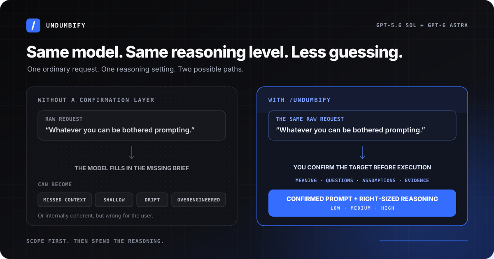

# /undumbify, /undumb and /undumbifymax - for using 5.6 & Astra on low-med-high without it being dumb

> **Draft: testing is ongoing. Expect bugs.** The skill can miss requirements, add unwanted constraints or ask unnecessary questions. Review every generated prompt before running it. Reliable outcomes and lower-effort performance have not yet been established by controlled testing.

## Want strong results without writing a miniature specification every time?

A short request leaves choices unstated. What outcome matters? Which context is relevant? How much evidence is enough? What is the model allowed to do? When should it stop?

Capable models fill those gaps themselves. Sometimes they choose well. Sometimes they miss context, add scope, underthink the task, overengineer it, or build an impressive answer around something you did not mean. More reasoning can make that answer more elaborate without making it more useful.



Undumbify adds a confirmation layer before execution. It:

- says what it thinks you mean;
- asks only the questions likely to change the result;
- makes important assumptions visible;
- checks that the final prompt still matches your answers; and
- returns one copy-ready prompt for a separate run.

It never runs the underlying task.

The aim is simple: **use the strongest suitable model at the lowest reasoning effort likely to do the job properly, and know why.**

## Pick the smallest mode that will do the job

| Command | Best for | What happens | Stops | Starting effort |
|---|---|---|---:|---|
| `/undumb` | A mostly clear request that needs a quick check | One short readback, up to two useful questions, then a compact prompt | 1 | Low |
| `/undumbify` | Most serious work | Intent check, relevant context, up to five high-value questions, assumptions and success checks | 2 | Low, sometimes Medium |
| `/undumbifyMAX` | Expensive mistakes, difficult research or complex systems | Deeper alignment, evidence and complexity limits, failure checks, then an end-state check | Up to 3 | Medium, sometimes High |

These are clarification modes, not reasoning settings. MAX does not automatically mean XHigh or Max reasoning.

### `/undumb`

Use it for rewrites, small builds, focused comparisons and straightforward decisions. It keeps the process short and returns a lean prompt, usually 150 to 300 words.

```text
/undumb Make the homepage feel lighter without changing the copy
```

Recommended starting point: GPT-5.6 Sol or GPT-6 Astra on Low.

### `/undumbify`

Use it when getting the scope, evidence, success test or permissions wrong would waste a meaningful amount of work. It can read relevant local context and investigate a clearly named capability gap. It is not limited to installed skills.

```text
/undumbify Work out whether we should replace first-line customer support with AI
```

Recommended starting point: Low. Use Medium when real ambiguity, research or interacting constraints remain.

### `/undumbifyMAX`

Use it for consequential strategy, high-stakes research, unfamiliar fields, major architecture or cross-domain systems. Optional modules can add real practitioner views, supporting and dissenting evidence, external tools and skill discovery, but only when they could materially improve the prompt.

External skills are checked for fit, instruction quality, trust, maintenance, testing, popularity and independent acclaim. Nothing is installed or run automatically.

```text
/undumbifyMAX Design how our consultancy should choose models, tools and external skills across different types of work
```

Recommended starting point: Medium. Use High for genuinely difficult synthesis or verification. Use XHigh or Max only when the eventual task itself justifies it.

## Why it works

### Meaning comes first

A longer prompt does not help if it describes the wrong job. The first readback lets you correct the model before it adds detail.

### Questions must earn their place

There is no quota. A question is asked only when different answers could change the result, scope, evidence, permissions, format, cost, success test or recommended effort.

STANDARD and MAX normally use simple A-D choices. Preference questions stay neutral. The model recommends an option only when known facts make one choice clearly safer or more useful.

### Important gaps cannot be hidden

Before writing the prompt, the skill asks itself: could a missing answer change the result? If yes, it asks, uses clearly labelled scenarios with your permission, or says the prompt is not ready.

### Your answers remain the source of truth

The final prompt is checked against the confirmed request and every answer. It cannot weaken a constraint, quietly expand permission, or turn an optional idea into a requirement.

If you list what the eventual run may do, that list is treated as complete. Nearby actions remain off-limits unless you approve them.

### Complexity needs a reason

Every extra source, tool, framework, skill, section or step must meet a confirmed need or prevent a named failure. Otherwise it comes out.

### The end state is checked last

The last check describes the result after the decisions have been made. It does not guess those decisions in advance.

## Designed for GPT-5.6 Sol and GPT-6 Astra

Undumbify is designed for highly capable, strongly steerable models. Its short stages make the target clear without loading a small task with MAX-sized instructions. Its question, evidence and complexity limits help contain unnecessary expansion.

Astra is the main design target. The same workflow also works with GPT-5.6 Sol and other capable instruction-following models.

Undumbify chooses effort from the confirmed task, not from the command name. That makes Low, Medium and High useful defaults while keeping XHigh and Max available for work that has a real reason to need them.

For the reasoning behind every stage, see [How Undumbify works](docs/how-it-works.md).

## What you get

- A recommended model and effort, with a short reason.
- The intended end state when the mode needs one.
- Any important assumptions or remaining risks.
- One copy-ready prompt.
- A brief fit-for-purpose check.
- A yes or no option to run another question round.

On first use, Undumbify uses sensible defaults and offers an optional preference questionnaire after producing the prompt. Setup does not use one of the mode's confirmation stops.

Unlazy stays separate. Undumbify only offers it when the eventual task has several independently checkable obligations and partial completion could look like success.

## Install

```bash
git clone https://github.com/I-Cam-Mc/undumbify.git ~/.codex/skills/undumbify
```

The canonical Codex invocation is `$undumbify`. Slash commands need this routing rule in `~/.codex/AGENTS.md`:

```markdown
### `/undumb`, `/undumbify`, and `/undumbifyMAX`

Treat these commands as explicit invocations of the installed `undumbify` skill:

- `/undumb` selects MIN.
- `/undumbify` selects STANDARD.
- `/undumbifyMAX` selects MAX.
- `/upgrade` is an optional legacy alias for STANDARD.
```

Restart Codex after installing the skill.

## Testing, feedback and suggestions

This is an experimental draft, not a fully validated release. Testing and fixes are ongoing. The cases in [`evals/`](evals/) cover whether each mode preserves the request, asks useful questions, respects its stop limit, stays prompt-only and avoids unnecessary effort. The [evaluation protocol](evals/PROTOCOL.md) separates skill failures from simulator errors; test definitions are not claims that every case passes.

The current draft prioritises existing success requirements and evidence of what is going wrong. These changes address observed failures, but the larger fixed-baseline comparison is still incomplete. See the [limited draft checks](evals/2026-09-05-draft-checks.md) for what was actually verified. No overall pass rate or Low/Medium/High reliability claim is made.

Real prompts are even more useful. If a mode asks a useless question, misses an important gap, adds ceremony, recommends too much effort or changes what you asked for, please [open an issue](https://github.com/I-Cam-Mc/undumbify/issues). Test cases and improvement suggestions are welcome.

When reporting a bug, include the command, model and effort, a redacted starting request, the relevant questions and answers, and what you expected instead. Do not post private data, credentials or confidential documents.

Material changes are recorded in the [changelog](CHANGELOG.md), including what changed and what should be tested again.

## Licence

MIT. See [LICENSE](LICENSE).
